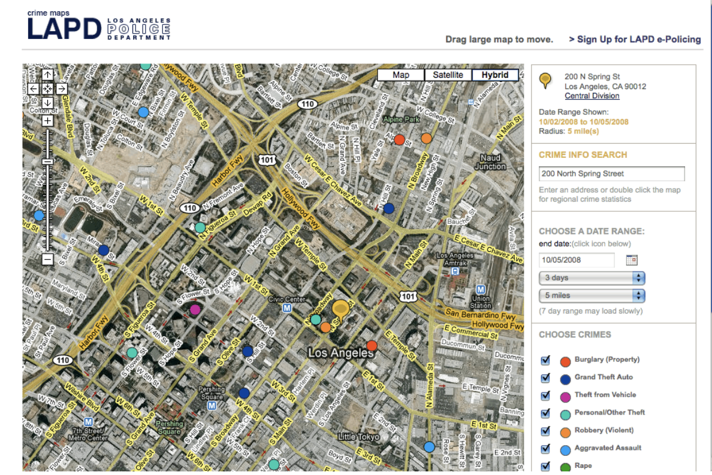
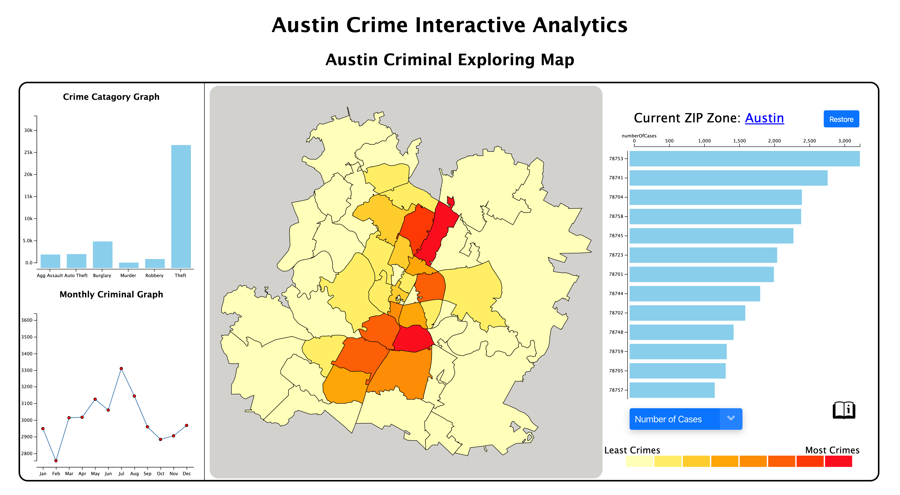
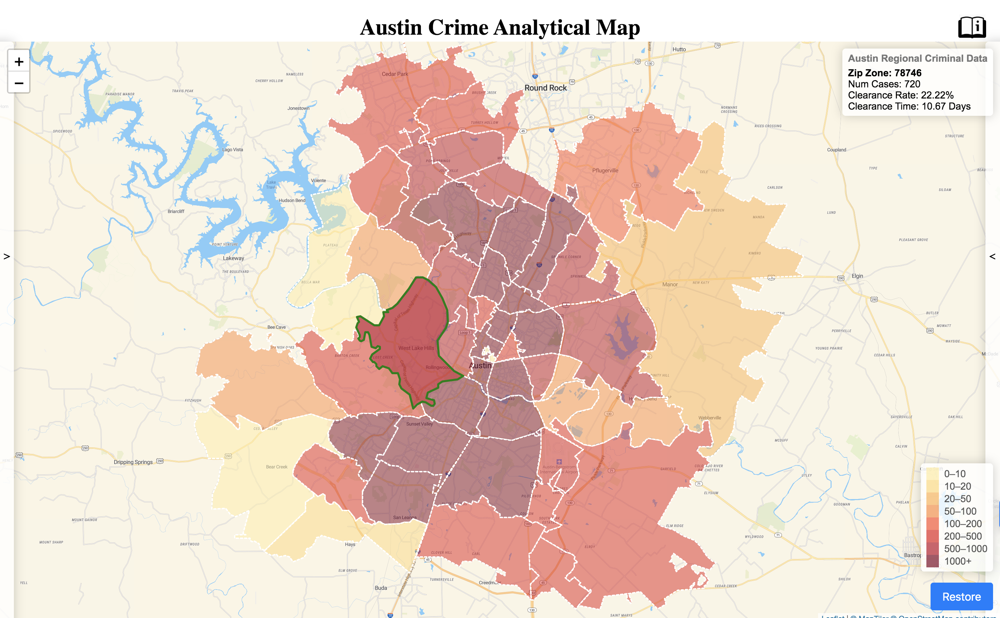

## **Crime Visualization in Austin: Towards an interactive pattern recognition**
Hongyi Li & Yuxin Zhang
### 1. Introduction
&nbsp;&nbsp;&nbsp;&nbsp;&nbsp;&nbsp;&nbsp;&nbsp;Crimes have been long existing to distort social welfare and adding to social anxiety. As hateful as they are, we have not seem to figure out an general-effective way to identify potential crimes and eradicate them despite the past crime data that we have. However, past data can still be analyzed and learned from as they contain information about possible crimes and can thus infer approaches for police resource distribution and neighbourhood building. [1]Studies have shown that geographic criminal pattern persists in certain areas,[2] and that there exists seasonality patterns in certain crime categories.
 &nbsp;&nbsp;&nbsp;&nbsp;&nbsp;&nbsp;&nbsp;&nbsp;Some criminal analytics techniques have been built to assist the authority of interest to analyze the past. Some of them only statistical numbers for public awareness, some contains detailed analytical tools such as the crime network building, real-time route track for the police bureau. [3]However, the former one cut too much analytical information for produce comparable result, as patterns and time-series shifts are disabled from interpretation. The latter one, good at initiating both tactical (short-term) and strategic (long-term) analysis, are too heavy as for functionality and too expensive as for price for the general public and the non-technical local police officers to use.
 &nbsp;&nbsp;&nbsp;&nbsp;&nbsp;&nbsp;&nbsp;&nbsp;Thus, we propose an interactive visualization way to contain enough analytical data to assist with geographical and seasonal pattern recognition, targeting both the general public and local policies for strategic planning, either for neighbourhood exploration or for police resource allocation. We would like to provide both the modelled conclusive data for reference and also the raw statistics for self-interpretation to cater to users of different interest and cognition level.
### 2. Related Work
&nbsp;&nbsp;&nbsp;&nbsp;&nbsp;&nbsp;&nbsp;&nbsp;Some web-based systems have been developed to assist with the strategic analysis and planning for the local police. For example, LAPD has its own crime analytical map that enabled geographical mapping of categorical crime number in a specific range of time, adjustable selection. In this way, geo patterns of different crimes can be clearly identified since crime categories are made distinguishable by various color encodings. 
 &nbsp;&nbsp;&nbsp;&nbsp;&nbsp;&nbsp;&nbsp;&nbsp;[5]Another example is the existing crime mapping designed for users who are concerned with the nerighbourhood safty. This map mainly allows the user to set a range of time and then explore different category of crime reported at that period of time in detail. In thisday, the crime map allows people to get an understanding about the overall saftyness and level of voilence around the neighbourhood of interest. 
      &nbsp;&nbsp;&nbsp;&nbsp;&nbsp;&nbsp;&nbsp;&nbsp;However, in both examples,seasonality patterns are hard to be perceived since the variation in time-series data have not been presented in a perceivable and easily analytiable way. Also, in both examples, the map allows flexible exploring for different users yet too few analytical or conclusive statistics are given to efficiently assist with decision-making. 
### 3. Our Methods
#### &nbsp;&nbsp;&nbsp;&nbsp;&nbsp;&nbsp;&nbsp;&nbsp;a. System overview
&nbsp;&nbsp;&nbsp;&nbsp;&nbsp;&nbsp;&nbsp;&nbsp;Our criminal analysis tool is designed to offer criminal information in two layers. On the first layer, we provide the explorable geographics for different users to self-explore and retain the information by looking at the specific data or plot for each geographic region. On the second layer, we also provide some modelled indexed, such as the weighted safety index deriving from different crimes, for the users to refer to as the general safety measurement.
 &nbsp;&nbsp;&nbsp;&nbsp;&nbsp;&nbsp;&nbsp;&nbsp;Our web-based criminal analysis tool are designed to be map-based. This is because we would like to enable self-exploring for different users, and we also would like to include the inherited geographic features such as the blocks and streets for users of interest to further identify. 
 &nbsp;&nbsp;&nbsp;&nbsp;&nbsp;&nbsp;&nbsp;&nbsp;Our criminal analysis map consists of three modules. There is the main map in the center, which contains regional data specifics when users hover over it. Then on the right side and left side of the main map, there would be two analytical bars, one for pattern recognition, which provides two graphs, on bar chart for crime category study, and one line chart for seasonality crime number study, each of them flexible for regional and comprehensive adjustment under selection action of users. Another side would provide the regional comparison for different statistics, such as the total number of crimes in a given time range, the clearance rate, the average clearance time.
#### &nbsp;&nbsp;&nbsp;&nbsp;&nbsp;&nbsp;&nbsp;&nbsp;b. Data analysis techniques
&nbsp;&nbsp;&nbsp;&nbsp;&nbsp;&nbsp;&nbsp;&nbsp;Data visualized in our map design system are arranged in a way that diversity in perspectives is provided in an interpretable way. For example, raw data is provided of all specifics regarding one reported crime, including the geographic location, crime category, reported time, clearance stage. Then we extract two major dimensions that are evaluated by us as being most important. One is the time dimension, of which we might capture the seasonality pattern of certain kinds of crimes. The other is the geographic dimension, of which we might recognize  the geo-pattern of certain crimes or the criminal clustering regions. In that sense, we decide to preprocess the data to attain the sectional features such as the number of crimes happening in a range of time, the clearance rate or the average clearance time so that the efficiency of the police or the violence level of each region can be more specifically measure and compared. 
 &nbsp;&nbsp;&nbsp;&nbsp;&nbsp;&nbsp;&nbsp;&nbsp;All our  data is checked for completion and integrity in python before going to be further processed. Because the flexibility we would like to enable in the visualization interaction, we write data process in javascript closures as functions after designing what the analytical data would be like. In this way, we retain the flexibility in interaction and also keep the amount of code needed at minimum. Besides, we also set up functions so that regional attributes can be obtained directly by inputting the regional zip code. This would too a large extent speed up the visualization process as we have already prepared all data in an easily-processable way. For example, if we would like to get the safty_Index of each Zip region, we can simply call the function Data.getAllSafetyIdx to get that. 
#### &nbsp;&nbsp;&nbsp;&nbsp;&nbsp;&nbsp;&nbsp;&nbsp;c. Visualization Design and Techniques
&nbsp;&nbsp;&nbsp;&nbsp;&nbsp;&nbsp;&nbsp;&nbsp;The tasks we would like to fulfill for the users, being local police for the general public concerned about the crime are as follows:
 &nbsp;&nbsp;&nbsp;&nbsp;&nbsp;&nbsp;&nbsp;&nbsp;1. Users can self-explore the Austine maps by zooming, dragging, hovering and clicking. Details regarding the regional crime numbers, clearance rate and average clearance time would be provided when user hovers the mouse over a specific Zip region.
 &nbsp;&nbsp;&nbsp;&nbsp;&nbsp;&nbsp;&nbsp;&nbsp;2. User can self-explore the regional crime clustering situation by selecting any crime to explore its geographical distribution
 &nbsp;&nbsp;&nbsp;&nbsp;&nbsp;&nbsp;&nbsp;&nbsp;3. Users would be given the option to add-in categorical and time-series analytical graph when exploring the regional specifics. 
 &nbsp;&nbsp;&nbsp;&nbsp;&nbsp;&nbsp;&nbsp;&nbsp;4. Users can easily navigate back to the original view of the whole Austin city.
 &nbsp;&nbsp;&nbsp;&nbsp;&nbsp;&nbsp;&nbsp;&nbsp;5. Users can compare the effectiveness of police resource allocation at different regions by a range of measurement such as total crime number, clearance rate, and average clearance time.

 &nbsp;&nbsp;&nbsp;&nbsp;&nbsp;&nbsp;&nbsp;&nbsp;The major interface would be a map with sectional cutoff by Zip code. In this major interface, the user can hover over the Zip regions to attain the regional crime specifics, zoom & drag for geographical details. The major interface also offers a manual for checking functionality descriptions, a selection for filtering the crime category to map, a corresponding color legend to check out the criminal scale, a restore button for immediate back to original viewpoint. Besides, on both sides of the major interactive map, there is a hidden section, which can be clicked on to reveal. The one on the left containing two regional analytical chat (one categorical bar chart and one time-series line chart) to assist with the regional analysis. The one on the right, on the other hand, is an aggregate vertical bar chart in conducting regional comparison and ranking, in which several measurements is given to select from.

### 4. Usage scenario
&nbsp;&nbsp;&nbsp;&nbsp;&nbsp;&nbsp;&nbsp;&nbsp;This interactive criminal analysis map can be used by users of different recognition level and different analytical purpose and depth. For example, the local police officer can identify certain seasonality pattern of the crime densities at different Zip sections, so that they can efficiently and flexibly allocate the police resources to tackle the needs. Also, administrative police officers can very simply use the comparison and ranking functionality of the statistical bars to compare the case-solving efficiency of police at different Zip sections, so that to give awards or penalty  accordingly. Other than assisting the processional decision-making, our interactive criminal map also caters to the general public usage by providing many self-exploring modules such as the regional specific data on hovering and the draggable and zoomable interactions.

### 5. Conclusion and Future work
#### &nbsp;&nbsp;&nbsp;&nbsp;&nbsp;&nbsp;&nbsp;&nbsp;a. Conclusion and Interesting Findings
&nbsp;&nbsp;&nbsp;&nbsp;&nbsp;&nbsp;&nbsp;&nbsp;In all, our interactive criminal analytical map provides insightful details and multi-perspectives for users of different purpose to customize their exploration of the crime situation in Austin. It is a demonstration derived upon the criminal dataset of Austin during 2015 using D3  and Leaflet Library. Some important perspectives have been given in an optional and interactive way to assist users with criminal situation analysis such as seasonal and geographic ones. Here are some of the interesting findings we had studying the Austin Crime dataset in 2015:
 &nbsp;&nbsp;&nbsp;&nbsp;&nbsp;&nbsp;&nbsp;&nbsp;1. Theft are the most prevelent crime category in all Zip areas in Austin.
 &nbsp;&nbsp;&nbsp;&nbsp;&nbsp;&nbsp;&nbsp;&nbsp;
2. June and October appears to be the most crime-intensive month in the year we studied regardless of the regional sections.
 &nbsp;&nbsp;&nbsp;&nbsp;&nbsp;&nbsp;&nbsp;&nbsp;
3. Crime clearance situation among Zip regions are diverse and had little to do with how much crime actually happened in that zone.

#### &nbsp;&nbsp;&nbsp;&nbsp;&nbsp;&nbsp;&nbsp;&nbsp;b. Future work and Improvements
&nbsp;&nbsp;&nbsp;&nbsp;&nbsp;&nbsp;&nbsp;&nbsp;Due to the limit of the time range and that being historical, our interactive map can not provide much information in the criminal situation across different years, and that it can only provide strategic instead of tactical advice on the authority of interest to take action. In this way, it might be improvised in the following ways:
 &nbsp;&nbsp;&nbsp;&nbsp;&nbsp;&nbsp;&nbsp;&nbsp;1. By connecting to a database, we keep criminal record across different years, so that we can bring-in time perspective in analyzing the situation with police resource allocation.
 &nbsp;&nbsp;&nbsp;&nbsp;&nbsp;&nbsp;&nbsp;&nbsp;2. Also, using enough continuous historical record data, we might even derive a prediction model on the regional crime situation.
 &nbsp;&nbsp;&nbsp;&nbsp;&nbsp;&nbsp;&nbsp;&nbsp;3. By incorporating more geographically specific data such as demographics, it might help to find the course of crime so that we can attempt to tackle accordingly.

### Reference: 
[1] Crime pattern analysis: A spatial frequent pattern mining approach Shashi Shekhar, Pradeep Mohan, Dev Oliver, and Xun Zhou
 [2] The Seasonality of Crime Victimization  U. S. Department of Justice Bureau of Justice Statistic
 [3] https://www.thoughtco.com/crime-mapping-and-analysis-1435686
 [4] https://www.gislounge.com/crime-mapping-and-analysis/
 [5]https://www.crimemapping.com/map

